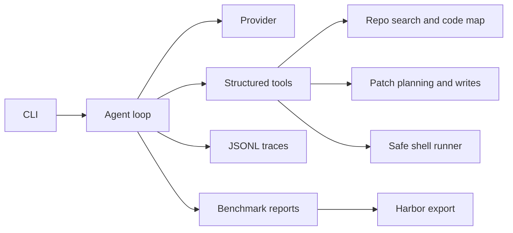

# Terminal Coding Agent

[](https://github.com/Rohanasudani/terminal-coding-agent/actions/workflows/ci.yml)
[](https://www.python.org/)
[](LICENSE)

A benchmarkable terminal coding agent inspired by tools like Claude Code and Codex. It can inspect a repository, plan changes, use structured tools, preview diffs, obey safety gates, track token/cost usage, and produce reproducible benchmark logs.

**Current baseline:** `8/8` local benchmark tasks pass with the deterministic repair provider.

## Why This Project Exists

Terminal agents are becoming the default interface for AI-assisted software work. The hard part is not a chat loop. The hard part is reliability: knowing what to read, when to edit, how to verify, how to avoid unsafe commands, and how to measure whether the agent is improving.

This project treats the agent as an engineering system:

- structured tools instead of free-form shell guessing
- repo search and file reads before edits
- write tools with diff previews
- approval gates for risky shell commands
- JSONL command logs for every tool call
- a local benchmark harness for regression testing
- provider abstraction for mock, OpenAI-compatible, or future model backends

## Architecture At A Glance



## Current Features

- `termagent run`: execute a task against a repository
- `termagent tools`: inspect available structured tools
- `termagent bench`: run local benchmark tasks and write a report
- repo search powered by `rg` when available
- Python, JavaScript, and TypeScript code map for symbols, imports, and references
- file read/write with path sandboxing
- shell execution with deny/approval policy
- git diff preview
- planned-write safety: the agent previews a patch before `write_file` can execute
- Python syntax validation before planned patches are approved
- test-first repair loop that runs the verifier, parses failures, searches likely symbols, patches, reruns tests, and reports the final diff
- deterministic mock provider for tests and demos
- deterministic repair provider for benchmarkable local coding tasks
- OpenAI-compatible provider with strict structured tool-call output and retry handling
- `termagent.toml` project config
- token usage and estimated model cost reporting
- live-mode cost ceilings, prompt profiles, validation recovery, and observation caps
- hardened shell execution without `shell=True`
- network commands blocked by default
- eight-task local benchmark suite with JSON and Markdown reports
- Harbor-shaped benchmark export and report comparison tooling
- persistent per-task trace artifacts for benchmark debugging
- JSONL traces for tool calls, observations, and final answers

## Quickstart

```bash
cd /Users/apple/.codex/workspaces/default/terminal-coding-agent
python3 -m venv .venv
source .venv/bin/activate
pip install -e ".[dev]"
pytest
termagent tools
termagent doctor
termagent run --repo tests/fixtures/sample_repo --task "Fix the calculator add bug and run tests"
termagent bench --repo-root .
termagent harbor-export --overwrite
termagent compare-bench bench/results/latest.json --label repair
```

## Live Model Mode

Create a project config:

```bash
cp termagent.example.toml termagent.toml
```

Then set your API key:

```bash
export OPENAI_API_KEY="your-api-key"
```

Run against a repository:

```bash
termagent run \
  --repo /path/to/repo \
  --task "Find the failing test, patch the bug, rerun tests, and show the final diff" \
  --provider openai \
  --approval-mode auto \
  --max-cost-usd 0.25
```

Use `repair` for deterministic local benchmark runs. Use `openai` when you want a real model to choose tools.

By default, live mode uses conservative settings: bounded observation context, a small model-cost ceiling, no network shell commands, and required patch previews before writes. Add `--allow-network-commands` only for trusted repositories and tasks that genuinely need network access. See [docs/security-audit.md](docs/security-audit.md) for the current safety audit and known limitations.

## Example

```bash
termagent run \
  --repo /path/to/repo \
  --task "Find the failing test, patch the bug, and show the final diff" \
  --approval-mode auto
```

Use `--approval-mode suggest` when you want the agent to stop before commands that require approval.

## Safety Model

The agent runs inside a repository root and rejects file access outside that root. Shell commands are classified before execution:

- safe read-only commands can run
- commands that modify files require approval mode
- destructive commands are blocked by default

This is intentionally conservative. A real terminal agent should make it harder to do dangerous things by accident.

## Benchmarking

The local benchmark harness copies each task fixture into an isolated temporary workspace, runs the agent, then runs the task verifier. Reports include pass/fail status, duration, trace path, and verifier output.

See [docs/benchmark-report.md](docs/benchmark-report.md) for the latest checked-in baseline.
See [docs/harbor-terminal-bench.md](docs/harbor-terminal-bench.md) for the Harbor/Terminal-Bench integration path.
See [docs/project-brief.md](docs/project-brief.md) for resume bullets and interview talking points.

Current local baseline:

| Provider | Tasks | Passed | Pass Rate | Model Cost |
| --- | ---: | ---: | ---: | ---: |
| repair | 8 | 8 | 100% | $0.000000 |

This is the bridge to Terminal-Bench-style evaluation: the agent is designed around reproducible tasks, verifier commands, execution logs, and pass/fail reports from day one.

## Documentation

- [Architecture](docs/architecture.md)
- [Architecture diagram](docs/architecture-diagram.md)
- [Benchmarking](docs/benchmarking.md)
- [Demo commands](docs/demo.md)
- [Repository intelligence](docs/repository-intelligence.md)
- [Security audit](docs/security-audit.md)
- [Project brief](docs/project-brief.md)

## Roadmap

- richer planning and reflection loop for repeated failures
- package TermAgent as a Harbor-compatible custom agent
- sub-agent orchestration experiments
- tree-sitter-backed repository intelligence
- interactive TUI
- GitHub-ready demo GIF and benchmark report
