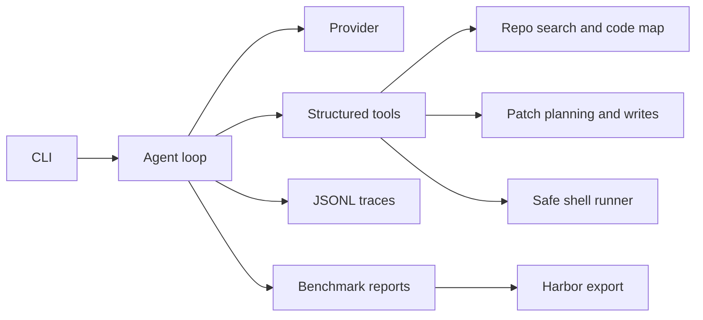

# Terminal Coding Agent

[](https://github.com/Rohanasudani/terminal-coding-agent/actions/workflows/ci.yml)
[](https://www.python.org/)
[](LICENSE)

A benchmarkable terminal coding agent inspired by tools like Claude Code and Codex. It can inspect a repository, plan changes, use structured tools, preview diffs, obey safety gates, track token/cost usage, and produce reproducible benchmark logs.

**Current baseline:** `8/8` local benchmark tasks pass with the deterministic repair provider.

Status: alpha. The first-release checklist is in [docs/release-readiness.md](docs/release-readiness.md).
The project now includes a repeated same-model Harbor comparison, measured
development ablations, and a frozen three-task Terminal-Bench 2 campaign.
Structured planning did not improve external pass rate: both TermAgent arms scored
0/3, while Codex `0.153.4` scored 2/3 with the same model. The failed and errored
trials are retained, so the project is not presented as outperforming established agents.
The recorded live calculator run predates the removal of heuristic controller patches;
it is historical integration evidence, not a current generalization score.

## Why This Project Exists

Terminal agents are becoming the default interface for AI-assisted software work. The hard part is not a chat loop. The hard part is reliability: knowing what to read, when to edit, how to verify, how to avoid unsafe commands, and how to measure whether the agent is improving.

This project treats the agent as an engineering system:

- structured tools instead of free-form shell guessing
- repo search and file reads before edits
- write tools with diff previews
- approval gates for risky shell commands
- JSONL command logs for every tool call
- a local benchmark harness for regression testing
- provider abstraction for mock, OpenAI-compatible, or future model backends

## Architecture At A Glance



## Current Features

- `termagent run`: execute a task against a repository
- `termagent app`: start an interactive terminal agent session
- `termagent tools`: inspect available structured tools
- `termagent bench`: run local benchmark tasks and write a report
- `termagent live-smoke`: run a tiny capped OpenAI provider smoke test
- `termagent campaign-verify`: verify frozen external task bytes against a manifest
- `termagent campaign-report`: validate and summarize a completed Harbor campaign
- structured task plans with declared output paths and acceptance checks
- bounded stagnation detection for repeated no-progress discovery
- repo search powered by `rg` when available
- Python, JavaScript, and TypeScript code map for symbols, imports, and references
- file read/write with path sandboxing
- shell execution with deny/approval policy
- git diff preview
- planned-write safety: the agent previews a patch before `write_file` can execute
- Python syntax validation before planned patches are approved
- test-first repair loop that runs the verifier, parses failures, searches likely symbols, patches, reruns tests, and reports the final diff
- deterministic mock provider for tests and demos
- deterministic repair provider for benchmarkable local coding tasks
- OpenAI-compatible provider with strict structured tool-call output and retry handling
- `termagent.toml` project config
- token usage and estimated model cost reporting
- live-mode cost ceilings, prompt profiles, validation recovery, and observation caps
- hardened shell execution without `shell=True`
- HTTPS certificate validation through `certifi` for live provider requests
- network commands blocked by default
- eight-task local benchmark suite with JSON and Markdown reports
- Harbor-shaped benchmark export and report comparison tooling
- optional Harbor 0.22.0 custom agent adapter and a controller-recovery ablation switch
- planning enabled/disabled controls recorded in local and Harbor benchmark metadata
- persistent per-task trace artifacts for benchmark debugging
- JSONL traces for tool calls, observations, and final answers

## Quickstart

```bash
git clone https://github.com/Rohanasudani/terminal-coding-agent.git
cd terminal-coding-agent
python3 -m venv .venv
source .venv/bin/activate
pip install -e ".[dev]"
pytest
termagent tools
termagent doctor
termagent bench --repo-root .
```

These commands use the deterministic provider and make no API calls. See
[the demo](docs/demo.md) for an isolated interactive run and terminal recording.
Python 3.11+ is required; Node.js 22+ runs the JavaScript fixtures.

## Live Model Mode

Create a project config:

```bash
cp termagent.example.toml termagent.toml
```

Then set your API key:

```bash
export OPENAI_API_KEY="your-api-key"
```

Run against a repository:

```bash
termagent run \
  --repo /path/to/repo \
  --task "Find the failing test, patch the bug, rerun tests, and show the final diff" \
  --provider openai \
  --approval-mode auto \
  --reasoning-effort high \
  --max-output-tokens 4096 \
  --max-cost-usd 0.25
```

Use `repair` for deterministic local benchmark runs. Use `openai` when you want a real model to choose tools.

By default, live mode uses conservative settings: bounded observation context, a per-response output ceiling, a small model-cost ceiling, no network shell commands, and required patch previews before writes. Reasoning effort is explicit when provided. Add `--allow-network-commands` only for trusted repositories and tasks that genuinely need network access. See [docs/security-audit.md](docs/security-audit.md) for the current safety audit and known limitations.

## Example

Start the interactive app:

```bash
termagent app --repo /path/to/repo --approval-mode suggest
```

Inside the session:

```text
termagent> :doctor
termagent> Fix the failing tests and show the final diff
termagent> :quit
```

Run a one-off task:

```bash
termagent run \
  --repo /path/to/repo \
  --task "Find the failing test, patch the bug, and show the final diff" \
  --approval-mode auto
```

Use `--approval-mode suggest` when you want the agent to stop before commands that require approval.

## Safety Model

The agent runs inside a repository root and rejects file access outside that root. Shell commands are classified before execution:

- safe read-only commands can run
- commands that modify files require approval mode
- destructive commands are blocked by default

This is intentionally conservative. A real terminal agent should make it harder to do dangerous things by accident.

## Benchmarking

The local benchmark harness copies each task fixture into a temporary workspace,
runs the agent, then grades allowlisted solution files against pristine fixture
tests in a separate workspace. A repair only passes if the original fixture fails
and the submitted solution passes. Reports include trial number, provider, model,
duration, token usage, estimated cost, independent score, and agent completion status.

The live controller can redirect repeated failing commands toward inspection, but
does not generate patches or write files on the model's behalf. Completion requires
a zero exit status from the configured verifier after the latest write or shell command.

Three additional public development tasks cover pagination, configuration precedence,
and cache expiration. See [evaluation instructions](docs/evaluation.md). These are
not a held-out benchmark or a Terminal-Bench result.

See [docs/benchmark-report.md](docs/benchmark-report.md) for the latest checked-in baseline.
See [docs/harbor-terminal-bench.md](docs/harbor-terminal-bench.md) for the Harbor/Terminal-Bench integration path.
See [docs/live-provider-demo.md](docs/live-provider-demo.md) for the sanitized live-provider smoke-test report.
See [docs/milestone17-results.md](docs/milestone17-results.md) for the same-model Codex comparison and controller ablation.
See [docs/milestone18-results.md](docs/milestone18-results.md) for pinned external-task failures and analysis.
See [docs/milestone19-results.md](docs/milestone19-results.md) for the structured-planning development ablation.
See [docs/milestone20-results.md](docs/milestone20-results.md) for the frozen Terminal-Bench 2 campaign.
See [docs/project-brief.md](docs/project-brief.md) for the project rationale, design decisions, and evaluation status.

Current local baseline:

| Provider | Tasks | Passed | Pass Rate | Model Cost |
| --- | ---: | ---: | ---: | ---: |
| repair | 8 | 8 | 100% | $0.000000 |

Matched Harbor development baseline using `openai/gpt-5.6-luna`, three trials each:

| Agent | Passed | Mean agent time | Reported cost |
| --- | ---: | ---: | ---: |
| TermAgent | 3/3 | 20.149s | $0.008784 |
| Codex 0.153.4 | 3/3 | 9.733s | $0.011622 |

This small development task supports an integration and failure-analysis claim, not
a general performance ranking. See the results document for controls and limitations.

Pinned external results are currently `0/1` for both TermAgent and Codex on
`html-js-filter`, and `0/1` in both TermAgent recovery arms on
`payments-pipeline-fix`. These failures are retained rather than excluded.

Frozen Terminal-Bench 2 campaign using `openai/gpt-5.6-luna`, one trial per task:

| Agent arm | Passed | Errors | Known cost |
| --- | ---: | ---: | ---: |
| TermAgent planning on | 0/3 | 1 | $0.037058 partial |
| TermAgent planning off | 0/3 | 1 | $0.046531 partial |
| Codex 0.153.4 | 2/3 | 0 | $0.057692 |

This small campaign found no planning benefit. It supports a reproducible comparison
and failure-analysis claim, not a full Terminal-Bench ranking.

This is the bridge to Terminal-Bench-style evaluation: the agent is designed around reproducible tasks, verifier commands, execution logs, and pass/fail reports from day one.

## Documentation

- [Architecture](docs/architecture.md)
- [Architecture diagram](docs/architecture-diagram.md)
- [Benchmarking](docs/benchmarking.md)
- [Demo commands](docs/demo.md)
- [Interactive app](docs/interactive-app.md)
- [Live provider demo](docs/live-provider-demo.md)
- [Matched benchmark results](docs/milestone17-results.md)
- [External validation results](docs/milestone18-results.md)
- [Structured planning results](docs/milestone19-results.md)
- [Frozen Terminal-Bench 2 results](docs/milestone20-results.md)
- [Repository intelligence](docs/repository-intelligence.md)
- [Requirements traceability](docs/requirements-traceability.md)
- [Security audit](docs/security-audit.md)
- [Project rationale](docs/project-brief.md)

## Roadmap

- fix repository-independent final review and provider transport recovery
- evaluate the next general improvements on a different held-out subset
- sub-agent orchestration experiments
- tree-sitter-backed repository intelligence
- richer terminal UI
- GitHub-ready demo GIF and benchmark report
