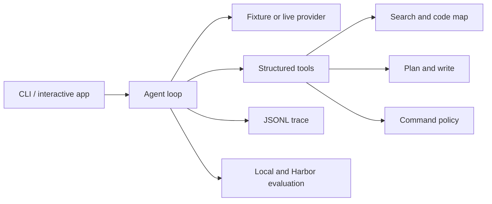

# Terminal Coding Agent

[](https://github.com/Rohanasudani/terminal-coding-agent/actions/workflows/ci.yml)
[](https://www.python.org/)
[](LICENSE)

TermAgent is a Python terminal coding agent built around structured tools, explicit
safety gates, reproducible traces, and benchmark-driven development. It can inspect a
repository, plan and preview edits, run verifiers, and report token and cost usage.

The project is alpha software. It is useful on trusted local repositories, but it is
not an operating-system sandbox and it does not claim a public Terminal-Bench score.

## What It Does

- repository search plus Python, JavaScript, and TypeScript symbol indexing
- single-file and grouped patch previews before writes
- repository-root path confinement
- shell command classification with approval modes
- test-first execution and completion checks
- JSONL traces for tool calls, observations, and final summaries
- OpenAI-compatible live provider with strict function schemas
- token, estimated cost, retry, context, and output limits
- interactive and one-shot CLI modes
- local regression tasks and Harbor/Terminal-Bench campaign tooling



## Install

```bash
git clone https://github.com/Rohanasudani/terminal-coding-agent.git
cd terminal-coding-agent
python3 -m venv .venv
source .venv/bin/activate
python -m pip install -e ".[dev]"
termagent doctor
```

Python 3.11 or newer is required. Node.js is optional and is used by the JavaScript
fixture and wheel-installation check.

## Run It

Start the interactive app:

```bash
termagent app --repo /path/to/repo --approval-mode suggest
```

Inside the session:

```text
termagent> :doctor
termagent> Fix the failing tests and show the final diff
termagent> :quit
```

Run one task:

```bash
termagent run \
  --repo /path/to/repo \
  --task "Find the failing test, patch the bug, rerun tests, and show the diff" \
  --provider openai \
  --approval-mode suggest \
  --reasoning-effort high \
  --max-output-tokens 4096 \
  --max-cost-usd 0.25
```

Live mode reads `OPENAI_API_KEY` from the environment. Raw traces and local config
belong under `.termagent/` or `termagent.toml`; both are ignored by Git.

## Provider Modes

- `openai` asks a live model to choose structured tool calls.
- `fixture` uses transparent task-specific patterns for offline runtime regression.
- `mock` is a stable local test alias.

The fixture suite currently passes `8/8`. That result checks orchestration, grading,
tracing, and tool contracts. It is not evidence that the agent generalizes to unseen
repositories.

## Safety Model

File tools resolve paths inside the configured repository. Writes require matching
patch-plan hashes. Shell commands run as parsed argument lists rather than through a
shell. Destructive commands and shell control operators are blocked; network commands
are disabled unless explicitly enabled. Mutating options such as `sed -i`,
`find -fprint`, and `git diff --output` cannot use the read-only path.

Use `approval_mode=suggest` for normal work. `auto` permits non-destructive mutations
that pass the policy and should only be used in disposable or trusted environments.

See [docs/security.md](docs/security.md) for the complete threat model and limitations.

## Evaluation Snapshot

The project keeps failed trials instead of reporting only successful demos.

| Campaign | TermAgent | Comparator | Notes |
| --- | ---: | ---: | --- |
| Same-model development task | 3/3 | Codex 3/3 | Integration evidence only |
| First frozen Terminal-Bench 2 subset | 0/3 per planning arm | Codex 2/3 | One error per TermAgent arm |
| Post-recovery frozen subset | 0/3 per planning arm | Codex 3/3 | One setup error per TermAgent arm |

The latest external run identified three concrete gaps: portable installation across
task images, stronger completion checks, and better conversion of repository evidence
into correct edits. These are limited one-trial subsets, not leaderboard results.

Methods, versions, task checksums, costs, and failure analysis are in
[docs/experiment-log.md](docs/experiment-log.md). The exact frozen campaign settings
remain machine-readable under [`bench/campaigns`](bench/campaigns).

## Development

```bash
ruff check .
pytest -q
termagent bench --repo-root .
python -m compileall -q src tests scripts
python -m pip wheel . --wheel-dir .termagent/release-wheels
python scripts/check_wheel.py
```

The benchmark command uses the fixture provider unless another provider is selected.
Live benchmark runs should use frozen tasks, explicit budgets, and separate output
paths under `.termagent/`.

## Documentation

- [Design](DESIGN.md)
- [Architecture](docs/architecture.md)
- [Benchmarking](docs/benchmarking.md)
- [Experiment log](docs/experiment-log.md)
- [Security](docs/security.md)

## Current Work

- portable Harbor installation for task images without the expected Python toolchain
- completion review that distinguishes a weak visible check from task completion
- incremental repository snapshots for large codebases
- tree-sitter-backed JavaScript and TypeScript indexing
- broader repeated external evaluation after those changes are frozen
