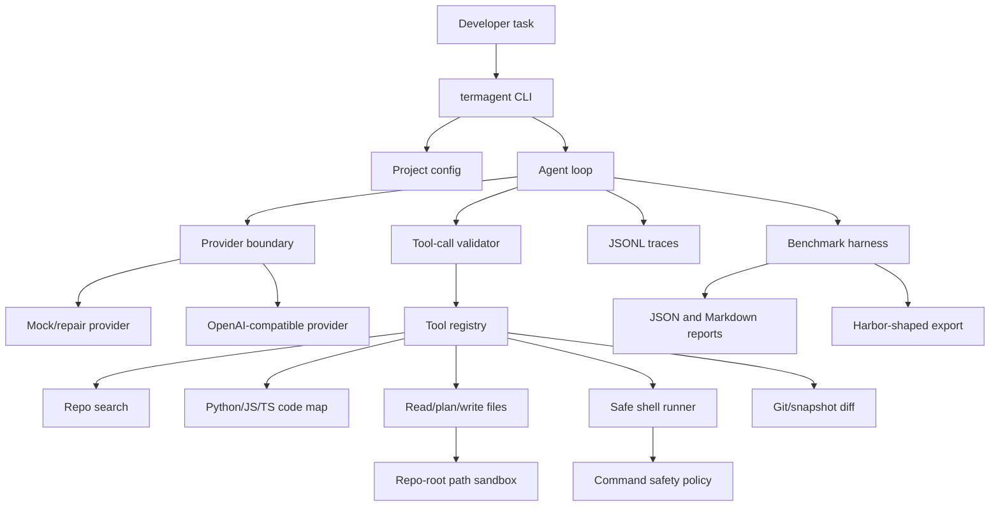

# Architecture Diagram

```mermaid
flowchart TD
    User[Developer task] --> CLI[termagent CLI]
    CLI --> Config[Project config]
    CLI --> Agent[Agent loop]
    Agent --> Provider[Provider boundary]
    Provider --> Mock[Mock/repair provider]
    Provider --> OpenAI[OpenAI-compatible provider]
    Agent --> Validator[Tool-call validator]
    Validator --> Tools[Tool registry]
    Tools --> Search[Repo search]
    Tools --> CodeMap[Python/JS/TS code map]
    Tools --> Files[Read/plan/write files]
    Tools --> Shell[Safe shell runner]
    Tools --> Diff[Git/snapshot diff]
    Files --> Sandbox[Repo-root path sandbox]
    Shell --> Policy[Command safety policy]
    Agent --> Trace[JSONL traces]
    Agent --> Bench[Benchmark harness]
    Bench --> Reports[JSON and Markdown reports]
    Bench --> Harbor[Harbor-shaped export]
```
