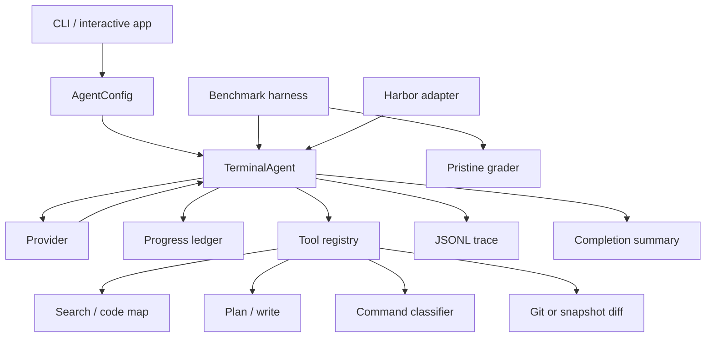

# Architecture

## System Overview

TermAgent has four runtime boundaries: provider, controller, tools, and evaluation.
The provider proposes one structured action. The controller validates progress and
completion. Tools perform repository-scoped operations. Evaluation grades the final
workspace independently from the agent's own completion state.

```mermaid
flowchart TD
    CLI[CLI / interactive app] --> Config[AgentConfig]
    Config --> Agent[TerminalAgent]
    Agent --> Provider[Provider]
    Provider --> Agent
    Agent --> Planning[Progress ledger]
    Agent --> Registry[Tool registry]
    Registry --> Search[Search / code map]
    Registry --> Files[Plan / write]
    Registry --> Shell[Command classifier]
    Registry --> Diff[Git or snapshot diff]
    Agent --> Trace[JSONL trace]
    Agent --> Summary[Completion summary]
    Bench[Benchmark harness] --> Agent
    Bench --> Grader[Pristine grader]
    Harbor[Harbor adapter] --> Agent
```

## Module Map

| Area | Modules | Responsibility |
| --- | --- | --- |
| Runtime | `agent.py`, `models.py`, `planning.py`, `completion.py` | state transitions, validation, completion evidence |
| Providers | `provider.py`, `fixture_provider.py`, `pricing.py` | live API boundary, offline fixture behavior, cost |
| Tools | `tools.py`, `safety.py` | repository operations, command policy, diffs |
| Intelligence | `code_map.py`, `diagnostics.py`, `observations.py` | symbols, references, failure parsing |
| Interfaces | `cli.py`, `interactive.py`, `config.py`, `health.py` | commands, app loop, configuration, diagnostics |
| Evaluation | `bench.py`, `grading.py`, `campaign.py`, `experiments.py` | local grading and frozen campaign reports |
| Harbor | `harbor.py`, `harbor_agent.py`, `harbor_runner.py` | task export and container execution |
| Observability | `logging.py`, `live_smoke.py` | traces and sanitized smoke reports |

## Agent Loop

`TerminalAgent` owns the execution loop and mutable `AgentState`. A step consists of:

1. Ask the provider for a `ToolCall`.
2. Validate tool name and arguments.
3. Apply plan, evidence, repetition, cost, and completion rules.
4. Execute through `ToolRegistry`.
5. Record the call, result, usage, and phase.
6. Return a bounded observation to the provider.

The loop stops on verified completion, cost exhaustion, repeated invalid calls,
stagnation, provider failure, or the step limit. A final summary distinguishes the
agent's completion flag from independent grading.

## Planning And Progress

Planning is optional so it can be evaluated as an ablation. `set_task_plan` records a
goal, expected output paths, and acceptance checks. Planning-enabled required-change
runs cannot preview a patch until this contract exists.

`ProgressLedger` records coarse phases and evidence:

- discovery calls and their signatures
- inspected paths and symbols
- search queries
- patch plans and writes
- verifier attempts
- transition deferrals and stagnation

After a bounded discovery budget, further inspection is rejected until the provider
registers a plan or submits exact contents through a patch-preview tool. The controller
never authors those contents.

Strict completion adds a second contract after `git_diff`. The provider calls
`submit_completion_review` with evidence keyed by each check's stable criterion ID and any residual
risks. `completion.py` independently checks verifier state, diff paths, declared output
coverage, and verifier strength. A known smoke verifier needs a passing behavioral test
or targeted execution recorded after the latest file write.

## Tool Registry

The registry exposes:

- `search`
- `list_files`
- `read_file`
- `code_map`
- `find_references`
- `set_task_plan`
- `submit_completion_review`
- `plan_patch` and `plan_patch_set`
- `write_file` and `write_patch_set`
- `run_shell`
- `git_diff`

Every file path is resolved against the repository root. Patch planning validates
Python syntax and returns SHA-256 content identifiers. Writes must match a prior plan.

`git_diff` compares tracked files against the run's starting commit, so commits and branch
operations created during a run remain visible even when the final working tree is clean.
It combines that result with a startup snapshot of nonignored untracked files. For
non-Git workspaces it compares eligible text files against the
startup snapshot. The fallback skips generated directories, common local credential
files, symlinks, and files over 1 MB. If Git disappears after a Git-backed run starts,
the tool reports an error rather than claiming a complete diff.

## Repository Intelligence

Python indexing uses the standard-library AST and records classes, functions, methods,
imports, references, and parse errors. JavaScript and TypeScript indexing recognizes
common declaration, import, and identifier patterns with a conservative scanner.

Dependency and build directories such as `.git`, `.venv`, `node_modules`, `dist`, and
`build` are skipped. The scanner is intentionally incomplete; tree-sitter is the next
step before claiming broad language coverage.

## Provider Implementations

The live provider sends strict OpenAI function definitions and requires a tool call.
Responses are parsed into `ProviderOutput`, including token usage, attempt count, and
usage-completeness state. Retryable transport errors receive bounded backoff. Billing,
authentication, and malformed-request failures are not retried as transient errors.

The fixture provider is intentionally different: it contains transparent patterns for
the bundled regression tasks. Keeping it in a separate module prevents those patterns
from being mistaken for live-agent reasoning.

## Shell Execution

Commands are tokenized with `shlex` and executed with `shell=False`. The classifier
distinguishes read-only, approval-required, destructive, network, inline interpreter,
and shell-control behavior. Command-specific mutation flags prevent tools such as
`sed`, `find`, and read-only Git subcommands from writing through the automatic path.

This is policy enforcement, not process isolation. Candidate code still runs with the
current user's operating-system permissions.

## Benchmark And Harbor Paths

The local harness copies each fixture into a temporary workspace, verifies that the
original is broken, runs the agent, then overlays only allowlisted solution files onto
a pristine copy for grading. Test edits and configuration changes in the agent's
workspace cannot enter the grader copy.

The Harbor adapter uploads a pure-Python wheel bundle and probes the task image for Python
3.11+. If needed, it can bootstrap Python through `apt`, `apk`, or `dnf`, then re-probes
and records that setup action. It imports TermAgent directly through `PYTHONPATH`; it
does not install the wheel with pip or create a virtual environment. Reports record both the
TermAgent wheel hash and aggregate bundle hash. The adapter then executes the same
runtime and writes a summary for the external verifier. Frozen campaign manifests pin
task hashes, models, versions, limits, retries, completion policy, and comparison arms.

## Runtime Artifacts

Local traces, provider credentials, generated wheels, benchmark jobs, and live reports
belong under `.termagent/` and are ignored. Public reports contain aggregate results and
sanitized failure analysis rather than raw model trajectories.
